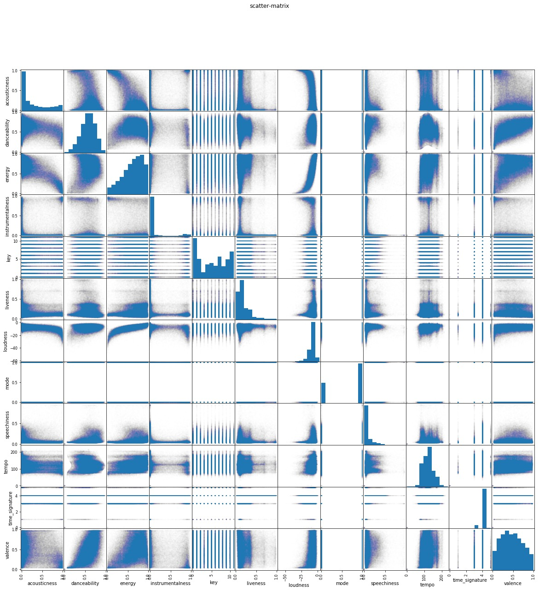

# CS109a Final Project: *Music Recommender System*
##### A project by Nicholas Kochanek, John Connelly, Christopher Jarrett, and Andrew Soldini	

## Overview: 
_Provide an overview of the project. It is important that you include a general context for the project as well as an overall description of the project. Any introductory information that’s specific to the project should also be included._

Streaming services like Spotify, Pandora, and Apple Music have radically reshaped the music industry in the last decade. The vast libraries of music that these sources have available to their users is unlike anything before it. Like the internet more broadly, the curse of so much content ultimately becomes finding the things that truly matter to users. The fundamental challenge of content discovery presents an open ended challenge to these streaming platforms of presenting users with the best recommendations. Successfully filtering and curating music for listeners is ultimately a very key differentiator between streaming platforms. Good or bad recommendations can spell the success or failure of services in acquiring and retaining users. 

Because songs are relatively short and listened to in succession of one another, the primary unit of recommendation that we deal with is that of the ___playlist___. Playlists are a series of songs in particular succession that are grouped to be played at the same time. Playlists can be characterized by a mood or a genre that people look to use enhance the spirit of a moment in their lives. This is why is the essential unit of recommendation for music. Being able to produce coherent, or even good, playlists has the potential to greatly improve our music listening experiences.

To this end, Spotify has been investing heavily in their data science in order to improve recommendations to users. One specific effort that Spotify launched is _[Spotify RecSys Challenge 2018](https://recsys-challenge.spotify.com/)_. In this challenge, entrants are tasked to create effective recommendation systems for playlist generation under different sets of conditions in both allowable datasets and input data. Users are given a song, or multiple, and are tasked with generating a relevant, enjoyable playlist from the start. T  

In this project, we set out to accomplish many of the goals of the Spotify Challenge in our own playlist recommendations. We pursued various common methods of recommendation systems along with methods of our own devising in tackling the playlist recommendation challenge.

## Motivation: 
_Introduce the project motivation both as a whole as well as motivations for important defining aspects of your work. For example were there any visualization or UI primitives that informed your work?_

The motivation behind this project as a whole stems from the incredible business value that companies draw from making good recommendations to users. Our personal motive comes from our own experiences as users of music streaming services. We have a personal interest and value in effective recommendation algorithms. The ability to generate good playlists is something that both us and our friends are very interested in being able to use in our daily lives. We all have, at one point or another, worked hard to compile a high quality playlist for our friends' and our own enjoyments. It is therefore something that touches us on an engaging, tangible level. 

As aspiring data scientists, these services are also treasure troves of data that we can use to make interesting insights on. The digital nature of Spotify's libraries and interfaces means that every part of the user experience can be turned into high quality data. The sheer scale of this data is mind-boggling, and therefore interesting to work on. Throughout this project, the amount of data was also a somewhat limiting factor in our analysis due to our limited computing resources available.

As for the motivation behind the techniques that we employed, we wanted to stay true to the Spotify Challenge, focusing our generation of new playlists primarily based on actual user-generated playlists. Because of this, our models were ones that could see the data as a graphical web of interactions between songs that appear together in these user generated playlists. We also believed that our model's method and performance can be well demonstrated through the use of an interactive React web app that we have hosted and linked to below. We have really worked to bring this challenge to life.

## Description of Data and EDA: 
_What data are you dealing with? What methods have you used to explore the data (incl. initial explorations, models, data cleansing and reconciliation, etc)? What insights did you gain? How did those methods influence your work?_

In the spirit of the assignment, and the spotify challenge more generally, the dataset that we primarily worked with was the _"Million Playlist Dataset"_. This dataset has about one million playlists that have been generated by users. The idea behind using this as the primary method for the recommendation system is that the best way to create good playlists is to view playlists that people have made. In using this dataset, we are actually content agnostic. That is, the recommendations have nothing to do with the actual content of the song, just how they are placed with other songs. 

__Can anyone elaborate on EDA of the Million Playlist Data?__

To better understand the situation, however, we also explored the in depth audio feature data that is accessible for individual songs from the Spotify API. 
 

^This scatter should probably be removed? I put it in for convenience and to see how it looks online. Generally, however, do we have good visualizations to put in?

## Literature Review/Related Work: 
_This can include noting any key papers, texts, other software sources, talks or websites that you have used to develop your modeling approach and/or that informed your demo/site._

Going to primarily discuss the winning teams of the spotify challenge here

## Modeling Approach: 
_What was your baseline model for comparison? What further models did you implement? Description of your implementations beyond the baseline model. Briefly summarize any changes in your project goals or implementation plans you have made along the way. These changes are a natural part of any project, even those that seem the most straightforward at the beginning. The story you tell about how you arrived at your results can powerfully illustrate your process._

Are we saying the baseline model is the collaborative filtering as thats the go-to in recommendation systems?

Then I think Nick, if you could explain your model here that would be huge. 

Link to model demonstration: [Our Model Demonstration](http://ec2-3-16-137-40.us-east-2.compute.amazonaws.com:3000/)

## Results: 
_Describe the results and emphasize the most important results. Did you have to reconsider some of the original assumptions?_

## Conclusions and Summary: 
_Review what was discussed in the Overview and Motivation sections (don’t repeat them word-for-word!). Discuss your contributions including the successes and areas for improvement._

## Future work: 
_Discuss extensions to and new directions for your work. What do you think would be interesting to pursue next? Are there any ideas worth exploring that you didn’t get a chance to explore?_

Sparse matrices for collaborative filtering?

