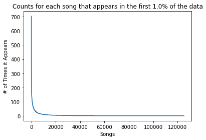
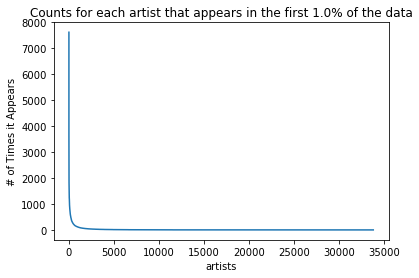
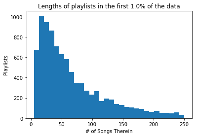
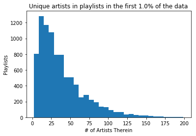

# CS109a Final Project: *Music Recommender System*
##### A project by Nicholas Kochanek, Jack Connolly, Christopher Jarrett, and Andrew Soldini

## Overview:
_Provide an overview of the project. It is important that you include a general context for the project as well as an overall description of the project. Any introductory information that’s specific to the project should also be included._


Streaming services like Spotify, Pandora, and Apple Music have radically reshaped the music industry in the last decade. The vast libraries of music that these sources have available to their users is unlike anything before it. Like the internet more broadly, the curse of so much content ultimately becomes finding the things that truly matter to users. The fundamental challenge of content discovery presents an open ended challenge to these streaming platforms of presenting users with the best recommendations. Successfully filtering and curating music for listeners is ultimately a very key differentiator between streaming platforms. Good or bad recommendations can spell the success or failure of services in acquiring and retaining users.

Because songs are relatively short and listened to in succession of one another, the primary unit of recommendation that we deal with is that of the ___playlist___. Playlists are a series of songs in particular succession that are grouped to be played at the same time. Playlists can be characterized by a mood or a genre that people look to use enhance the spirit of a moment in their lives. This is why is the essential unit of recommendation for music. Being able to produce coherent, or even good, playlists has the potential to greatly improve our music listening experiences.

To this end, Spotify has been investing heavily in their data science in order to improve recommendations to users. One specific effort that Spotify launched is _[Spotify RecSys Challenge 2018](https://recsys-challenge.spotify.com/)_. In this challenge, entrants are tasked to create effective recommendation systems for playlist generation under different sets of conditions in both allowable datasets and input data. Users are given a song, or multiple, and are tasked with generating a relevant, enjoyable playlist from the start. T  

In this project, we set out to accomplish many of the goals of the Spotify Challenge in our own playlist recommendations. We pursued various common methods of recommendation systems along with methods of our own devising in tackling the playlist recommendation challenge.

## Motivation:
_Introduce the project motivation both as a whole as well as motivations for important defining aspects of your work. For example were there any visualization or UI primitives that informed your work?_

The motivation behind this project as a whole stems from the incredible business value that companies draw from making good recommendations to users. Our personal motive comes from our own experiences as users of music streaming services. We have a personal interest and value in effective recommendation algorithms. The ability to generate good playlists is something that both us and our friends are very interested in being able to use in our daily lives. We all have, at one point or another, worked hard to compile a high quality playlist for our friends' and our own enjoyments. It is therefore something that touches us on an engaging, tangible level.

As aspiring data scientists, these services are also treasure troves of data that we can use to make interesting insights on. The digital nature of Spotify's libraries and interfaces means that every part of the user experience can be turned into high quality data. The sheer scale of this data is mind-boggling, and therefore interesting to work on. Throughout this project, the amount of data was also a somewhat limiting factor in our analysis due to our limited computing resources available.

As for the motivation behind the techniques that we employed, we wanted to stay true to the Spotify Challenge, focusing our generation of new playlists primarily based on actual user-generated playlists. Because of this, our models were ones that could see the data as a graphical web of interactions between songs that appear together in these user generated playlists. We also believed that our model's method and performance can be well demonstrated through the use of an interactive React web app that we have hosted and linked to below. We have really worked to bring this challenge to life.


## Description of Data and EDA:
_What data are you dealing with? What methods have you used to explore the data (incl. initial explorations, models, data cleansing and reconciliation, etc)? What insights did you gain? How did those methods influence your work?_

In the spirit of the assignment, and the spotify challenge more generally, the dataset that we primarily worked with was the _"Million Playlist Dataset"_. This dataset has about one million playlists that have been generated by users. The idea behind using this as the primary method for the recommendation system is that the best way to create good playlists is to view playlists that people have made. In using this dataset, we are actually content agnostic. That is, the recommendations have nothing to do with the actual content of the song, just how they are placed with other songs.

As for the content of the playlists then, we inspected the numbers of songs and artists that occur and the frequencies with which they occur in the playlists. In these frequencies, there is an incredible skew reflecting how hard it is to be popular in music. There are a few songs that are incredibly popular and then the vast majority of songs and artists appear only once in the sample.

 

Another facet of the dataset that we explored was the average length of the playlists. This distribution was also incredibly right skewed. The median playlist was of length 49 tracks, with the mean being around 66 tracks. As for the artists, the median was 30 with a mean of 38 artists per playlist. This shows that there is a clear tendency for artists to be grouped in playlists with other songs from the same artist. It is also likely that longer playlists include more repeat artists because of what appears to be less skew in the

 

To better understand the situation, however, we also explored the in depth audio feature data that is accessible for individual songs from the Spotify API. The data on songs from the API rates songs on particular features such as "energy", "danceability", or "valence" (a measure of how positive or negative the emotions in the songs are). Ultimately the models that we built using these features as a primary predictor of the next song was not at all good when it came down to evaluation.


## Literature Review/Related Work:
_This can include noting any key papers, texts, other software sources, talks or websites that you have used to develop your modeling approach and/or that informed your demo/site._

The primary literature review for this project is the review of the [paper resulting from the Spotify Challenge](https://arxiv.org/pdf/1810.01520.pdf). In this paper, there is a discussion of the evaluation methods and the most successful models within the competition.

We first of all used this in order to get a sort of benchmark for how well the top performing models do on this problem, so we could know how well we are doing when comparing our own models. They note that most of the top performing models utilized some kind of two stage architecture, where the first stage "retrieves a small set of tracks (compared to the total number of tracks in the dataset), while the second stage focuses on re-scoring or re-ranking the output of the first stage model with the goal of accuracy improvement." This means that the first stage favors high recall (getting most of the relevant songs, but possibly more), while the second stage prefers high precision (getting only highly relevant songs). Also, matrix factorization was heavily used, leading us to be interested in trying out collaborative filtering, which mainly using matrix factorization. Other teams also used neural networks and other techniques to learn word embeddings in order to extract useful information from the playlist titles and other natural language features. Because the paper notes that many of the models weren't able to significantly improve using the title of the playlist, we chose to ignore that feature. Also, the creative track curiously had lower scores than the main track, even though it had access to more data sources. They attributed this to the large space of possible songs and data and thought the model wasn't able to properly learn everything, so again our two main models just focus on the Million Playlist Dataset.

For our collaborative filtering approach, we researched previous implementations and attempts at this, as it has been a common approach in the past for music recommendations. [This paper](https://arxiv.org/abs/1209.3286v1) used filtering with user-based similarity in order to recommend songs to users (as opposed to continuing playlists). It provided a good basis from which to start implementing our own version of filtering.

Our last model, based on a Markov Chain random walk, was inspired by the description of the web as a random walk (as noted in many CS courses). In our research, we found that Markov Chains had sometimes been applied to give recommendations for webpages to visit (even in tandem with collaborative filtering), but didn't find anything as it related to music recommendation/playlist continuation. In [this paper](https://cdn.uclouvain.be/public/Exports%20reddot/iag/documents/WP123_Fouss.pdf), the authors discuss an application Markov Chains to recommendations on the web. We used this as guidance when implementing our own system.

## Modeling Approach:
_What was your baseline model for comparison? What further models did you implement? Description of your implementations beyond the baseline model. Briefly summarize any changes in your project goals or implementation plans you have made along the way. These changes are a natural part of any project, even those that seem the most straightforward at the beginning. The story you tell about how you arrived at your results can powerfully illustrate your process._

The
Are we saying the baseline model is the collaborative filtering as thats the go-to in recommendation systems?

Then I think Nick, if you could explain your model here that would be huge.

Link to model demonstration: [Our Model Demonstration](http://ec2-3-16-137-40.us-east-2.compute.amazonaws.com:3000/)

#### 1. Clustering and KNN based on Audio Features  
**Motivation:** Our motivation for this model was to be very much a baseline for the other models. Intuitively, we wanted to test how well the audio features could predict how close songs were, independent of data from the MPD. We thought that we might be able to achieve some combination of clustering and nearest neighbors modeling to do better than random chance (which almost never retrieves relevant songs).

**Implementation:** As we implemented it, our model predicts in two steps. First, it clusters all songs it has seen before, then for each input of seed songs (some $K \in [1,5,10,25,50]$), finds the 'closest' songs to those, in some way. The class we implemented has three different predict methods, namely `predict`, `predict2`, and `predict3`. They all use the Spotify API audio features to cluster and make predictions, relatively ignoring the MPD aside as input and output uris. The first simply calculates the most populous cluster among the input data, then randomly samples 500 songs from that cluster. The second tries to match the distribution of input songs more closely, outputting the number of songs in the input per cluster scaled up for a total of 500. Finally, the last method uses the audio features even more, calculating the 'distance' of every song in the same cluster to the 'average' of the input songs, outputting the 500 songs closest to the average, in order. Overall, these methods do fairly poorly at matching the held out songs, only retrieving relevant songs fairly rarely. The R-precision of these methods is in the range of 0.005-0.011. The pseudocode for `predict3` goes like follows (for a single input playlist):

```
1. Find the max_cluster in the input

2. Calculate the average features for the input
3. Calculate the distance between average and each song

4. Return the 500 'closest' songs in the cluster
```

<!--<iframe src="http://ec2-3-16-137-40.us-east-2.compute.amazonaws.com:3000/" width="100%" height="800"> </iframe> -->

## Results:
_Describe the results and emphasize the most important results. Did you have to reconsider some of the original assumptions?_

We decided to evaluate our models based on the same metrics used in the Spotify RecSys [contest rules](https://recsys-challenge.spotify.com/rules), namely R-Precision (RPrec), Normalized Discounted Cumulative Gain (NDCG), and Recommended Song Clicks (RSC). In the following definitions, $G$ is the set of ground truth tracks representing the held out songs from each playlist and $R$ is the ordered list of recommended songs returned by the recommendation system.

* R-Precision: The metric counts "number of retrieved relevant tracks divided by the number of known relevant tracks," rewarding the total number of retrieved relevant tracks, regardless of order.

* Normalized Discounted Cumulative Gain (NDCG): This metric takes into account the order of the returned songs, rewarding relevant songs placed higher in the returned list. It is calculated as Discounted Cumulative Gain (DCG), divided by the Ideal Discounted Cumulative Gain (IDCG), where the returned songs are ordered perfectly.

* Recommended Songs Clicks (RSC): This measures how many "clicks" a Spotify user would need to find the first relevant song in the recommendations (the first song actually in the rest of the playlist $G$), where Spotify displays recommended songs in groups of 10. Therefore it's simply finding the first relevant song and returning its position in the list divided by 10 and truncated.

The more formal mathematical description of these metrics can again be found in the [contest rules](https://recsys-challenge.spotify.com/rules) for Spotify's challenge, while the code implementing them is in our notebook.


## Conclusions and Summary:
_Review what was discussed in the Overview and Motivation sections (don’t repeat them word-for-word!). Discuss your contributions including the successes and areas for improvement._

Overall, we have seen that the filtering and network models perform the best, significantly improving over the baseline models using nearest neighbor techniques. Our final models were comparable with some of the top models in the RecSys challenge, so we are very satisfied with our results. If we had more time and computing power, we would have liked to scale both of those models up larger, as they were both limited in terms of their size (the network was trained on about 14000 playlists and ended up being about 7GB while filtering was only able to handle about HOW MANY PLAYLISTS). Ideally, we would be able to utilize sklearn's suppoer for sparse matrices to scale up filtering, but we weren't able to finalize that.

Music recommendation is, in general, a challenging problem when we have millions of diverse songs to choose from. More complex techniques like deep RNNs and autoencoders seemed attractive at the beginning of the project, but ultimately weren't feasible for us to complete. This forced us to adapt and implement the fairly different models seen here. Overall, we feel confident in our model's ability to find relevant songs to continue and put together a great playlist.

## Future work:
_Discuss extensions to and new directions for your work. What do you think would be interesting to pursue next? Are there any ideas worth exploring that you didn’t get a chance to explore?_

Sparse matrices for collaborative filtering?
