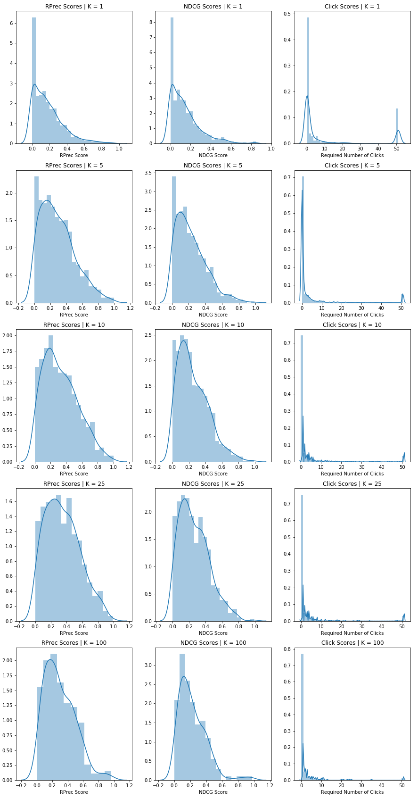

# CS109a Final Project: *Music Recommender System*
##### A project by Nicholas Kochanek, Jack Connolly, Christopher Jarrett, and Andrew Soldini

## Overview:

Streaming services like Spotify, Pandora, and Apple Music have radically reshaped the music industry in the last decade. The vast libraries of music that these sources have available to their users is unlike anything before it. Like the internet more broadly, the curse of so much content ultimately becomes finding the things that truly matter to users. The fundamental challenge of content discovery presents an open ended challenge to these streaming platforms of presenting users with the best recommendations. Successfully filtering and curating music for listeners is ultimately a very key differentiator between streaming platforms. Good or bad recommendations can spell the success or failure of services in acquiring and retaining users.

Because songs are relatively short and listened to in succession of one another, the primary unit of recommendation that we deal with is that of the ___playlist___. Playlists are a series of songs in particular succession that are grouped to be played at the same time. Playlists can be characterized by a mood or a genre that people look to use enhance the spirit of a moment in their lives. This is why is the essential unit of recommendation for music. Being able to produce coherent, or even good, playlists has the potential to greatly improve our music listening experiences.

To this end, Spotify has been investing heavily in their data science in order to improve recommendations to users. One specific effort that Spotify launched is _[Spotify RecSys Challenge 2018](https://recsys-challenge.spotify.com/)_. In this challenge, entrants are tasked to create effective recommendation systems for playlist generation under different sets of conditions in both allowable datasets and input data. Users are given a song, or multiple, and are tasked with generating a relevant, enjoyable playlist from the start.

In this project, we set out to accomplish many of the goals of the Spotify Challenge in our own playlist recommendations. We pursued various common methods of recommendation systems along with methods of our own devising in tackling the playlist recommendation challenge.

## Motivation:

The motivation behind this project as a whole stems from the incredible business value that companies draw from making good recommendations to users. Our personal motive comes from our own experiences as users of music streaming services. We have a personal interest and value in effective recommendation algorithms. The ability to generate good playlists is something that both us and our friends are very interested in being able to use in our daily lives. We all have, at one point or another, worked hard to compile a high quality playlist for our friends' and our own enjoyments. It is therefore something that touches us on an engaging, tangible level.

As aspiring data scientists, these services are also treasure troves of data that we can use to make interesting insights on. The digital nature of Spotify's libraries and interfaces means that every part of the user experience can be turned into high quality data. The sheer scale of this data is mind-boggling, and therefore interesting to work on. Throughout this project, the amount of data was also a somewhat limiting factor in our analysis due to our limited computing resources available.

As for the motivation behind the techniques that we employed, we wanted to stay true to the Spotify Challenge, focusing our generation of new playlists primarily based on actual user-generated playlists. Because of this, our models were ones that could see the data as a graphical web of interactions between songs that appear together in these user generated playlists. We also believed that our model's method and performance can be well demonstrated through the use of an interactive React web app that we have hosted and linked to below. We have really worked to bring this challenge to life.


## Description of Data and EDA:

In the spirit of the assignment, and the spotify challenge more generally, the dataset that we primarily worked with was the _"Million Playlist Dataset"_. This dataset has about one million playlists that have been generated by users. The idea behind using this as the primary method for the recommendation system is that the best way to create good playlists is to view playlists that people have made. In using this dataset, we are actually content agnostic. That is, the recommendations have nothing to do with the actual content of the song, just how they are placed with other songs.

As for the content of the playlists then, we inspected the numbers of songs and artists that occur and the frequencies with which they occur in the playlists. In these frequencies, there is an incredible skew reflecting how hard it is to be popular in music. There are a few songs that are incredibly popular and then the vast majority of songs and artists appear only once in the sample.

 

The distribution of the top 20 artists over the first portion of the dataset is visualized below as a donut plot:


Another facet of the dataset that we explored was the average length of the playlists. This distribution was also incredibly right skewed. The median playlist was of length 49 tracks, with the mean being around 66 tracks. As for the artists, the median was 30 with a mean of 38 artists per playlist. This shows that there is a clear tendency for artists to be grouped in playlists with other songs from the same artist. It is also likely that longer playlists include more repeat artists because of what appears to be less right skew.


 

To better understand the situation, however, we also explored the in depth audio feature data that is accessible for individual songs from the Spotify API. The data on songs from the API rates songs on particular features such as "energy", "danceability", or "valence" (a measure of how positive or negative the emotions in the songs are). Ultimately the models that we built using these features as a primary predictor of the next song were not at all good when it came down to evaluation, mainly because they were fairly simple models and didn't take into account at all the structure of the playlist data. However, we did find some interesting things when exploring the data.

The scatter matrix below explores relationships between a subset of the audio features, namely liveness, energy, loudness, and tempo. We chose to explore these more closely, as they seemed intuitively to be more closely interdependent on one another.


This scatter matrix is mainly of interest because of the relationship between energy and loudness. The two features seem to be relatively positively correlated, so we will need to be careful of collinearity when we fit models with these predictors. As for the other predictors, we can see that we have a relatively good distribution across the range, which is to be expected because we have scaled this data to have mean of 0 and standard deviation of 1. This should make it work better when we apply distance based techniques like KMeans clustering and KNN to the data.

Further, we also looked directly at the distribution of each predictor below:


These plots are of great interest to us, as they display how our Spotify API features are distributed. This is super important when we apply these features to KMeans and KNN, as outliers or wide spreads could possibly sway the distance metrics inordinately. However, since we have already scaled our data, most of these plots look relatively normal. There are some features (like valence and tempo) that look much more normal, while others (like loudness and liveness) that are skewed either left or right. Additionally, time signature, mode, and key appear to be discrete values, so we may have to handle those carefully.


## Literature Review/Related Work:

The primary literature review for this project is the review of the [paper resulting from the Spotify Challenge](https://arxiv.org/pdf/1810.01520.pdf). In this paper, there is a discussion of the evaluation methods and the most successful models within the competition.

We first of all used this in order to get a sort of benchmark for how well the top performing models do on this problem, so we could know how well we are doing when comparing our own models. They note that most of the top performing models utilized some kind of two stage architecture, where the first stage "retrieves a small set of tracks (compared to the total number of tracks in the dataset), while the second stage focuses on re-scoring or re-ranking the output of the first stage model with the goal of accuracy improvement." This means that the first stage favors high recall (getting most of the relevant songs, but possibly more), while the second stage prefers high precision (getting only highly relevant songs). Also, matrix factorization was heavily used, leading us to be interested in trying out collaborative filtering, which mainly using matrix factorization. Other teams also used neural networks and other techniques to learn word embeddings in order to extract useful information from the playlist titles and other natural language features. Because the paper notes that many of the models weren't able to significantly improve using the title of the playlist, we chose to ignore that feature. Also, the creative track curiously had lower scores than the main track, even though it had access to more data sources. They attributed this to the large space of possible songs and data and thought the model wasn't able to properly learn everything, so again our two main models just focus on the Million Playlist Dataset.

For our collaborative filtering approach, we researched previous implementations and attempts at this, as it has been a common approach in the past for music recommendations. [This paper](https://arxiv.org/abs/1209.3286v1) used filtering with user-based similarity in order to recommend songs to users (as opposed to continuing playlists). It provided a good basis from which to start implementing our own version of filtering.

Our last model, based on a Markov Chain random walk, was inspired by the description of the web as a random walk (as noted in many CS courses). In our research, we found that Markov Chains had sometimes been applied to give recommendations for webpages to visit (even in tandem with collaborative filtering), but didn't find anything as it related to music recommendation/playlist continuation. In [this paper](https://cdn.uclouvain.be/public/Exports%20reddot/iag/documents/WP123_Fouss.pdf), the authors discuss an application Markov Chains to recommendations on the web. We used this as guidance when implementing our own system.

## Modeling Approach:

Link to a demonstration of our models working in real time: [Our Model Demonstration](http://ec2-3-16-137-40.us-east-2.compute.amazonaws.com:3000/)

#### 1. K-Nearest-Neighbors Based on Playlist


#### 2. Clustering and KNN based on Audio Features  
**Motivation:** Our motivation for this model was to be very much a baseline for the other models. Intuitively, we wanted to test how well the audio features could predict how close songs were, independent of data from the MPD. We thought that we might be able to achieve some combination of clustering and nearest neighbors modeling to do better than random chance (which almost never retrieves relevant songs).

**Implementation:** As we implemented it, our model predicts in two steps. First, it clusters all songs it has seen before, then for each input of seed songs (some K in [1,5,10,25,50]), finds the 'closest' songs to those, in some way. The class we implemented has three different predict methods, namely `predict`, `predict2`, and `predict3`. They all use the Spotify API audio features to cluster and make predictions, relatively ignoring the MPD aside as input and output uris. The first simply calculates the most populous cluster among the input data, then randomly samples 500 songs from that cluster. The second tries to match the distribution of input songs more closely, outputting the number of songs in the input per cluster scaled up for a total of 500. Finally, the last method uses the audio features even more, calculating the 'distance' of every song in the same cluster to the 'average' of the input songs, outputting the 500 songs closest to the average, in order. Overall, these methods do fairly poorly at matching the held out songs, only retrieving relevant songs fairly rarely. The R-precision of these methods is in the range of 0.005-0.011. The pseudocode for `predict3` goes like follows (for a single input playlist):

```
1. Find the max_cluster in the input

2. Calculate the average features for the input
3. Calculate the distance between average and each song

4. Return the 500 'closest' songs in the cluster
```

#### 3. Markov-Chain/Network Based Approach

##### Motivation:

Our network based approach was based around the idea that tracks that people have put together into playlists in the
past will likely be put together into playlists in the future. Thus we wanted to create a probabalistic method to
represent how "connected" tracks were to one another. In this sense, the basic approach of this model is to reccomend
songs based on how likely they are to belong with the seed songs.

##### Implementation:

This model is implemented as a weighted undirected graph. Essentially we can view the creation of the larger network as the summation of the smaller graphs created by each playlist.


After creating this network, we then normalize the edge weights by the total out degree of each song node to give a probability distribution for taking any given edge when starting at a node.

Now that we have a network that shows the relation of songs to one another, we need to define a way to get predictions from a current playlist/list of seed songs. Our current method in pseudocode is:

```
all_samples = ()
for song in seed_songs:
	sample 4000 songs, by taking a weighted 1-step random walk from the current song
	add the samples to all_samples

return the 500 most common songs in all_samples in decreasing order of occurrences
```

Because our model will return songs that share the most playlists with the seed songs because the random walks are weighted, this model now effectively implements the problem stated in its motivation, that is to return the songs that are most likely to have shared a playlist with the current songs in the past.


#### 4. Collaborative Filtering


## Results:

We decided to evaluate our models based on the same metrics used in the Spotify RecSys [contest rules](https://recsys-challenge.spotify.com/rules), namely R-Precision (RPrec), Normalized Discounted Cumulative Gain (NDCG), and Recommended Song Clicks (RSC). In the following definitions, G is the set of ground truth tracks representing the held out songs from each playlist and R is the ordered list of recommended songs returned by the recommendation system.

* R-Precision: The metric counts "number of retrieved relevant tracks divided by the number of known relevant tracks," rewarding the total number of retrieved relevant tracks, regardless of order.

* Normalized Discounted Cumulative Gain (NDCG): This metric takes into account the order of the returned songs, rewarding relevant songs placed higher in the returned list. It is calculated as Discounted Cumulative Gain (DCG), divided by the Ideal Discounted Cumulative Gain (IDCG), where the returned songs are ordered perfectly.

* Recommended Songs Clicks (RSC): This measures how many "clicks" a Spotify user would need to find the first relevant song in the recommendations (the first song actually in the rest of the playlist G), where Spotify displays recommended songs in groups of 10. Therefore it's simply finding the first relevant song and returning its position in the list divided by 10 and truncated.

The more formal mathematical description of these metrics can again be found in the [contest rules](https://recsys-challenge.spotify.com/rules) for Spotify's challenge, while the code implementing them is in our notebook.

#### 1. K-Nearest-Neighbors Based on Playlist

#### 2. K-Nearest-Neighbors Clustering on Audio Features

Because this model is meant to be very much a baseline, these metrics confirm our assumption that it does only a little better than random chance. While it regularly finds some songs (generally no more than 1 or 2) from the held out songs, the random chance model we tested nearly never retrieved a relevant song. We thought this would be a good baseline as well as giving us a chance to apply some models we learned in class, whereas the two better models we implemented were extensions that we didn't cover at all this semester. This results of the metrics for different values of K are below.

_Mean Scores by K_

| K       | Mean RPrec  | Mean NDCG Score | Mean Clicks Score |
| :-----: |:---:| :----:| :----:|
|  1  |   0.0058   |   0.0039  |   40.2597   |
|  5  |   0.0068   |   0.0046  |   38.3366   |
|  10 |   0.0075   |   0.005   |   37.3538   |
|  25 |   0.0084   |   0.0055  |   37.0864   |
| 100 |   0.0093   |   0.0061  |   34.1441   |

_Mean Scores by K_


#### 3. Markov-Chain/Network Based Approach

For a model based solely on choosing like-tracks in a probabalistic way, the network based approach performs impressively. While we did not have access to the official spotify test datasets, our tests suggest that our network based model is competitive with other submissions to the Spotify RecSys competition. The average scores of our model based on the three scoring metrics described earlier are as follows:


_Mean Scores by K_

| K       | Mean RPrec  | Mean NDCG Score | Mean Clicks Score |
| :-----: |:---:| :----:| :----:|
| 1     | 0.1708 | 0.1478 | 8.5900 |
| 5     | 0.2817 | 0.2356 | 3.2146 |
| 10    | 0.3124 | 0.2567 | 2.8128 |
| 25    | 0.3246 | 0.2665 | 2.8642 |
| 100   | 0.2811 | 0.2250 | 2.2162 |

_Mean Scores by K_


Above we can start to see trends in the various evaluation methods. It's important to note that because of constraints on local processing power, the network does not necessarily have nodes for all of the test songs which is hurting performance, but a natural drawback of the Markov-chain approach: namely the model itself is quite large. We counter this by randomly sampling songs from the network with equal weight whenever a seed song is not in the network.

Looking at the performance of the network approach based on the three scoring systems, we can see that the model seems to perform best for the RPrec score and NCDG score methods using K=25 seed songs, while the mean clicks required to find a relevant song is best with K=100 seed songs.

Furthermore, while we do not have access to the official test sets used by Spotify, we can start to see the benefits and drawbacks of the Markov-chain based model. The Markov-chain based model seems to perform best (relative to the other metrics) on the RPrec score. The best performing Spotify challenge contestant had a score of RPrec = .224 on the official test set, whereas, depending on the K value, our model had a mean RPrec in {0.17,0.28, 0.32, 0.28}. This should of course be taken with a grain of salt as our model most likely would not have had the best performance in the challenge, but does signal that it is a reasonably good approach.

Moving on to mean NCDG score, which takes into account the actual ranking of importance of the predictions into account, our model falls much closer to the middle of the pack in the RecSys leaderboards (again, this is a tough comparison given that we don't have the test set used in the challenge). With scores in the low 0.2 range, (roughly ~60th/110 in the actual challenge) we can start to see the drawbacks of the Markov model.

Lastly our mean Click Score again places the model in the relative middle of the pack for the RecSys leaderboards. Where exactly is unclear because there is no info on the test data and what the distribution of K was, however, it seems that the Markov-chain model can hold its own.

But why does the Markov-chain model apparently do so much better with the RPrec scoring method than the others? At its base, this makes sense because the whole idea of the model is that tracks that people put together on their own will likely be put together by people again. The one step random walk should do a fairly good job of getting the most likely songs as a set, but the ranking system of appearances in the sample set does not seem to perform as well as the other Spotify challenge methods for ensuring the most relevant songs are given first. This would suggest a need to work on the weighting system used by the algorithm. The mean Clicks Score also shows the issues as with the NCDG score, namely the member songs are not always ranked as the most relevant.

Moving on though, let's take a closer look at the score distributions based on K. First the below figure gives a quick glance of where the scores are in general.

_Distribution of Scores by K; Summary_


The above graph, however, only gives us a basic idea of what's going on. There are too many lines to allow us to analyze the behavior at each K value. Thus, let's take a closer look at the distributions for each score at each K value.

_Distribution of Scores by K; Individual_


In this more in-depth view of the scoring methods by K value, we can see the mean trends discussed earlier but in more detail. In terms of RPrec score, we can watch the distribution shift right showing the improved RPrec score as K increase, but then shift left again once K=100. We see a similar result in the NDCG scores. Interestingly we can see in the click scores that there are two main 'bumps' in the distribution. The first is around 1, showing that most times there is relevant song on the first page or in the first couple pages. Then there is another bump around 51 (the max value allowed per the SysRec evaluation specs), which shows that sometimes the reccomendations contain none of the expected songs. As K increases, however, we can see that the bump at 1 grows higher and higher, while the bump at around 51 shrinks showing the overal improvement in the predictions (based on click score) as K increases.


#### 4. Collaborative Filtering


## Conclusions and Summary:

Overall, we have seen that the filtering and network models perform the best, significantly improving over the baseline models using nearest neighbor techniques. Our final models were comparable with some of the top models in the RecSys challenge in some regards, so we are very satisfied with our results. If we had more time and computing power, we would have liked to scale both of those models up larger, as they were both limited in terms of their size (the network was trained on about 14000 playlists and ended up being about 7GB while filtering was only able to handle a limited subset of the data. In the scheme of the task, this is a significant drawback to our models because there may be limited computing power to be dedicated in actual production.

There are computational limits in music recommendation in general because of the immense amount of data to work with. The potential for future work that is in part outlined below addresses this concern. Model efficiency ultimately comes to play a huge role in the effectiveness of certain algorithms even if the performance of others could theoretically be better. More complex techniques like deep RNNs and autoencoders seemed attractive at the beginning of the project, but ultimately weren't feasible for us to complete. This forced us to adapt and implement the fairly different models seen here.  

Overall, we feel confident in our model's ability to find relevant songs to continue and put together a great playlist. By this standard, we accomplished much of our goal in emulating the RecSys Challenge. Toward the loftier goals of recommendation systems, it is unlikely our model in its current form is of practical value. Our introduction of a Markov random walk model is an elegant solution to this problem. The simplicity of the model, relative to its accuracy gives us hope that if modified presciently, it could be a very successful technique in music recommendation.

With regards to our personal motivations in undertaking this project, much has been learned through our efforts. Our own understanding of the problem, however, was greatly enhanced. As we are all aspiring data scientists, the work that we have done is foundational to our future research and industry implementations that will shape the future. We also go forward now with an enhanced understanding of the algorithms that are so influential in our own daily lives. 

To interact with the models and judge their reccommendations purely based off your preferences, we have a demo of them [Here](http://ec2-3-16-137-40.us-east-2.compute.amazonaws.com:3000/). (Depending on your screen size/resolution you may need to zoom out a bit, on mac its <kbd>⌘</kbd><kbd>-</kbd>)

## Future work:

Although our model performed very well, there are some different approaches that also could be further explored in solving this problem. For example, we would ideally have been able to utilize sklearn's support for sparse matrices to scale up collaborative filtering to include more of the dataset, but we weren't able to finalize that.

One could also have tried harder to emulate the most successful of the models from the Spotify Challenge. The patterns most common in their structures are all ones that we did not generally implement. The first thing that most groups did was break the problem up into a two stage process. The first part of the process being a way to gather a bunch of songs that are decent matches using a low cost kind of process on a large dataset. The second part was then using a higher cost method to narrow down to the best recommendations. Another thing that many successful models did were use a neural net in the recommendation model. Given the two-step process, we could have used a neural net for the second part. We did not go here because of the discouragement of using neural nets for this project by the course staff. One also could work in a seperate architecture for the cold-start variation of the problem. 

When all is said and done, recommendation of content is an unsolvable problem because of its subjective nature. For this reason, people will always be devising new methods to better predict people's tastes, musical and otherwise. With the great benefits of recommendation, however, come the risks of unintended discrimination. Our own models are as susceptible as any to recommend the most popular songs more than others. This has the risk of creating an echo-chamber of music where future listening is determined heavily by past listening. There are serious implications of discrimination afoot. Hopefully Spotify is fine tuning this practice in a way that is in the true interests of people and not just associated, sponsored material.  
